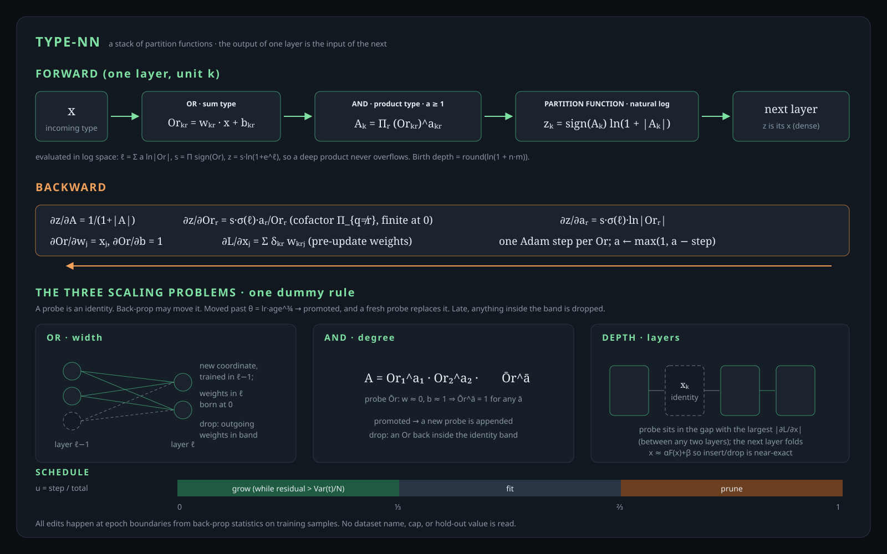

# type-nn

A neural network whose layers are partition functions. The algebra is the
one in [Type Mechanics](https://hadilq.com/posts/type-mechanics/): a type
is a generating function, an **Or** is a sum type, an **And** is a product
type, and the assembly index comes from
[assembly theory](https://en.wikipedia.org/wiki/Assembly_theory). The
activation is the natural log. Width, degree and depth are not
hyper-parameters: they are the three scaling problems the network solves
while it trains.

The goal is to beat the `c-mlp` baseline on the board by finding a more
general and better-optimised scaling strategy. It must do that without
caps or constants tuned to the current data sets.

The board has two type-nn models. They share the architecture and the
three scaling problems below and differ only in the scaling strategy:

| model | files | strategy |
|---|---|---|
| **type-nn** | `type_nn.c/h`, `type_nn_scale.c/h` | Knowledge changes only on significant evidence. A structure is kept, or promoted, only while it pays the Bayesian-information price of its parameters, measured on the training data. |
| **type-nn-overfit** | `type_nn_overfit*.c/h` | The previous type-nn, frozen. Probes are promoted on displacement alone and dropped only when they fall back to identity. It fits the training set about 10× more tightly than `c-mlp` at similar hold-out error. |



## Architecture

Layer $\ell$ maps $x\in\mathbb R^{n_\ell}$ to $z\in\mathbb R^{m_\ell}$.
Output unit $k$ is one And over its Ors $r$:

$$
\mathrm{Or}_{k,r} = w_{k,r}\cdot x + b_{k,r},
\qquad
A_k = \prod_r \mathrm{Or}_{k,r}^{\,a_{k,r}},
\qquad
z_k = \operatorname{sign}(A_k)\,\ln\bigl(1+|A_k|\bigr).
$$

- **Dense.** The output of one layer is the input of the next
  ($n_{\ell+1}=m_\ell$), and every Or reads every incoming coordinate, so
  a type-nn stack is as dense as an MLP.
- **Assembly index.** $a_{k,r}\ge 1$ is how many times the sub-object
  $\mathrm{Or}_{k,r}$ is used to assemble $A_k$. It is learned as a real
  number with $o^a := \operatorname{sign}(o)|o|^a$, so
  $\operatorname{sign}(A_k)=\prod_r\operatorname{sign}(\mathrm{Or}_{k,r})$.
  Its floor is 1 (a factor present at least once); removing a factor is a
  structural drop, not $a\to 0$.
- **Partition function.** $z=\operatorname{sign}(A)\ln(1+|A|)$ on every
  layer, the output layer included. There is no temperature and no
  special case for hidden layers.
- **Birth.** $\operatorname{round}(\ln(1+nm))$ layers,
  $n\to m\to\dots\to m$, where $n$ is the input width and $m$ the output
  width. Every unit starts as a single random Or (a degree-1 And), with
  the same init law as `c-mlp`.
  - xor 1, iris 3, wine 4, wdbc 3, diabetes 2, ionosphere 4.

The forward pass runs in log space: $\ell_k=\sum_r a_{k,r}\ln|\mathrm{Or}_{k,r}|$,
$s_k=\prod_r\operatorname{sign}\mathrm{Or}_{k,r}$ and $z_k=s_k\ln(1+e^{\ell_k})$.
A deep product never overflows.

## Backward

| quantity | value |
|---|---|
| $\partial z/\partial A$ | $1/(1+\lvert A\rvert)$ |
| $\partial z/\partial \mathrm{Or}_r$ | $s\,\sigma(\ell)\,a_r/\mathrm{Or}_r$, which is $\partial z/\partial A$ times the cofactor $a_r\lvert\mathrm{Or}_r\rvert^{a_r-1}\prod_{q\ne r}\mathrm{Or}_q^{a_q}$. At $\mathrm{Or}_r=0$ exactly: the cofactor if $a_r=1$, else 0. |
| $\partial z/\partial a_r$ | $s\,\sigma(\ell)\ln\lvert\mathrm{Or}_r\rvert$ |
| $\partial \mathrm{Or}/\partial w_j,\ \partial \mathrm{Or}/\partial b,\ \partial \mathrm{Or}/\partial x_j$ | $x_j,\ 1,\ w_j$ |

Every gradient is taken with the pre-update weights, then each Or takes
one Adam step and $a\leftarrow\max(1,a-\text{step})$. `make test` checks
every gradient against central finite differences (the error falls as
$h^2$). The derivation, including the zero-factor case, is in
[doc/forward-backward.md](doc/forward-backward.md).

## The three scaling problems

All three follow one dummy rule. A **probe** is an identity. Back-prop is
free to move it. A probe that back-prop moved out of the identity band is
**promoted**, and a fresh probe takes its place. Late in training,
anything that has fallen back inside the band is **dropped**.

| axis | probe (scale up, early) | drop (scale down, late) |
|---|---|---|
| **Or**: width | The previous layer grows a new output coordinate (a trained unit). The current layer meets it with weights born at exactly 0, so the function does not move. It is promoted when those weights leave the band. | A coordinate whose outgoing weights are inside the band. The consumer's bias absorbs its mean contribution. |
| **And**: degree | Each And carries one identity Or ($w\approx0$, $b\approx1$), and $1^{a}=1$ for every $a$. When back-prop gives it weight, it is promoted and a new identity Or is appended. | An Or back inside the band, i.e. a second identity in the And. Every And keeps at least one Or. |
| **Depth**: layers | One identity layer (unit $k$ is the carrier $\mathrm{Or}=x_k$ times an identity Or) sits in the gap with the largest mean $\lvert\partial L/\partial x\rvert$. That gap can be between any two layers, not only at the ends. An unpromoted probe moves to the loudest gap each epoch. | A layer within the band of the identity. The output layer is never removed. |

**Near-exact depth edits.** A type-identity layer emits
$F(x)=\operatorname{sign}(x)\ln(1+|x|)$, which equals $x$ only to first
order. When one is inserted, the next layer's columns absorb the best
affine fit $x\approx\alpha F(x)+\beta$ measured on the epoch that just
ran. When one is removed, they absorb the reverse fit. Coq
`fold_exact` proves this is exact whenever the fit is.

All edits happen at epoch boundaries. They read only what back-prop
produced on the training samples: parameter displacements, input-gradient
magnitudes and junction statistics. No dataset name, count cap or
hold-out value is ever read.

### Schedule

$u=\text{step}/\text{total}$. **Grow** on $u<\tfrac13$, **fit** on the
middle third, **prune** on $u\ge\tfrac23$. Probes that are still
identities when pruning starts are retired. A probe that left the band
during the fit phase is kept and counted as promoted.

Growth also requires an **unexplained residual**. The epoch's training
MSE must exceed $\operatorname{Var}(t)/N$: the constant predictor's loss
divided by the number of training samples. Once the whole training set's
residual is worth less than one sample's share of the trivial model,
nothing is left to pay for new structure. The model reads the targets
from its own gradient, $t=y-m\,\partial L/\partial y$. This gate is what
stops Adam's scale-invariant steps on vanishing gradients from being read
as "back-prop wants this probe". Without it, one XOR seed grew to 1,464
parameters.

### Dynamic threshold

Under per-sample Adam with step $\eta$, $T$ steps of zero-mean gradient
noise move a parameter about $\eta\sqrt T$. A one-signed gradient moves
it up to $\eta T$. A probe of age $T$ counts as moved when its RMS
distance from the identity exceeds

$$
\theta(T)=\eta\,T^{3/4}=\sqrt{\eta\sqrt T\cdot\eta T},
$$

the log-midpoint of the two scales (Coq `threshold_geometric_mean`).
Noise falls behind it as the probe ages. A push reaches it once it is at
least $T^{-1/4}$ of the maximum. It is computed from the run ($\eta$
and the probe's age), in `tnn_threshold_up`. Both models use it for
promotion.

In **type-nn-overfit**, $\theta(N)$ (one epoch's worth, $N$ samples) is
also the identity band for drops (`tnno_threshold_band`). **type-nn**
has no drop band: it drops by measured evidence (next section).

### The prior of knowledge (type-nn)

type-nn-overfit decides with displacement alone, so any structure
back-prop moves is kept. type-nn adds a prior: a structure must be worth
its parameters. For an item with $k$ parameters (an Or, a coordinate
between two layers, or a layer), on $n = N m$ training observations:

$$
n \ln\frac{\mathrm{MSE}_{\text{without}}}{\mathrm{MSE}_{\text{with}}} \;>\; k \ln n
\qquad\text{(BIC)}
$$

$\mathrm{MSE}_{\text{without}}$ is **measured**. The item is reset to its
identity (an Or to $w{=}0,b{=}1,a{=}1$; a coordinate to a zero outgoing
column; a layer to its carrier), and the network is evaluated on the
training pairs back-prop saw in the epoch. The model recovers the
targets from the gradient, $t = y - m\,\partial L/\partial y$. Because the
ablation *is* the identity, removing an item that failed is exact.

- **Grow.** A probe is promoted when back-prop moved it past $\theta(T)$
  (as before) **and** it passes BIC. Otherwise it stays a probe and keeps
  training.
- **Prune.** Every Or and coordinate is a candidate. They are ablated in
  order of the damage each does alone, and the ablated set keeps growing
  while the network stays no worse than the best model seen while
  pruning. Formally, the criterion
  $C = n\ln\mathrm{MSE} + K\ln n$ ($K$ = all parameters) may never
  exceed its best value so far.
- **Layers.** At most one per boundary. A layer is removed on trial with
  the fold, measured, and restored if $C$ would get worse.

Why each of these parts is there (each was measured, not assumed):

- **Why measure instead of estimating.** Reading $\Delta\mathrm{MSE}$
  from Adam's second moment (the empirical Fisher) was off by 10–20× per
  Or in both directions. Greedy pruning on those estimates collapsed
  iris, wine and XOR.
- **Why the best-so-far reference.** Judging each boundary against that
  epoch's own MSE let one Adam blip (a 70× loss spike) license a mass
  drop, from 162 to 74 parameters in one step.
- **Why promotion needs displacement too.** Requiring BIC alone at
  promotion starved growth, because a one-epoch-old probe is near
  identity and cannot show evidence yet.
- **Variants rejected.** Using an unbiased residual variance
  $\mathrm{RSS}/(n-K)$, or a noise floor $\mathrm{Var}(t)/N$, in the
  criterion made XOR unlearnable (4 observations cannot justify any XOR
  model) and destabilised wine. Plain BIC is what the board runs.

What it costs:

- **Departure from the original spec.** The evidence rule runs forward
  passes over the training samples. That departs from "every decision
  reads only back-prop quantities". It never reads the hold-out.
- **Training time.** Measuring evidence makes training 1.8–5.2× slower
  than type-nn-overfit on these tasks.
- **Remaining overfitting.** BIC's noise estimate is the training MSE,
  which is itself small on these networks (1e-4 on wine), so the prior is
  still lenient where type-nn overfits most. This is the open problem for
  the next iteration.

### Constants that remain, and why

| constant | where | status |
|---|---|---|
| Adam $\beta_1,\beta_2,\varepsilon$ and `TNN_LR_SCALE` = 0.1 | `common.h` | Shared by both models; cannot favour either. |
| task epochs and lr | `bench.c` | Shared by both models; inherited from the previous board. |
| schedule thirds, 1/3 and 2/3 | both `*_scale.c` | The least-informative split. A candidate for the dynamic schedule. |
| BIC price $k\ln n$ | `type_nn_scale.c` | The standard criterion; $n$, $k$ and the MSE come from the run. |
| exponent 3/4 | threshold | Derived (geometric mean), not fitted. |
| probe noise amplitude $\eta$ | probes | One Adam step, the smallest meaningful move. |
| $a\ge1$ | assembly index | The definition of a factor that is present. |
| `c-mlp` hidden width 8 / 16 | `c_mlp.c` | The baseline's fixed definition. type-nn never reads it. |

There is no `max_or`, no `max_and`, no depth cap, no top-k, and no
per-dataset table.

## Board

`./bench.sh` writes [BOARD.txt](BOARD.txt). All three models go through one
harness (`bench.c`) with the same protocol:

- The same fixed 70/30 split, with standardisation fitted on the training
  rows only.
- The same per-epoch shuffle, per-sample Adam (`common.h`), mean-MSE
  $(y-t)/m$, epochs, lr, and readout $F$.
- 5 initialisation seeds per cell, reported as mean ± sd.
- `params` counts every learnable scalar present after training: dense,
  with nothing skipped for being small.

| task | type-nn | type-nn-overfit | c-mlp | type-nn vs c-mlp | params type-nn / overfit / c-mlp |
|---|---|---|---|---|---|
| iris | 0.0215 ± 0.0069 | 0.0249 ± 0.0044 | 0.0280 ± 0.0061 | lower, within noise | 125 / 175 / **67** |
| wine | 0.0277 ± 0.0048 | 0.0209 ± 0.0105 | 0.0234 ± 0.0056 | higher, within noise | **170** / 393 / 275 |
| wdbc | 0.0448 ± 0.0048 | 0.0459 ± 0.0030 | 0.0438 ± 0.0017 | higher, within noise | **163** / 163 / 513 |
| diabetes | **0.0329 ± 0.0010** | 0.0371 ± 0.0015 | 0.0488 ± 0.0042 | **clear win** | **20** / 33 / 193 |
| ionosphere | 0.0886 ± 0.0111 | **0.0813 ± 0.0119** | 0.1461 ± 0.0155 | **clear win** | **154** / 298 / 577 |
| xor (fit only) | train 0.0000 | train 0.0000 | train 0.0000 | — | **26** / 108 / 33 |

Hold-out MSE, mean ± sd over 5 seeds. A gap is "clear" when it exceeds
two standard errors of the difference.

How to read this:

- **Params: type-nn uses fewer parameters than `c-mlp` on 5 of 6 tasks**
  (0.11× on diabetes, 0.27× on ionosphere, 0.32× on wdbc, 0.62× on wine,
  0.80× on xor). Iris is the exception at 1.87×.
- **Hold-out: it clearly beats `c-mlp` on diabetes and ionosphere.**
  Iris is lower but within noise; wine and wdbc are higher but within
  noise. It does *not* win every task.
- **Against its frozen predecessor:** fewer parameters on every task
  except wdbc (a tie), and lower hold-out error on iris, wdbc and
  diabetes.
- **Remaining overfitting.** Training MSE is still far below `c-mlp`'s
  (1e-4 on wine), so the prior is lenient where the network overfits
  most; see "The prior of knowledge" above.
- **Inference cost** relative to `c-mlp` ranges from 0.3× on ionosphere
  (faster, because type-nn is 4× smaller there) to 8.8× on iris, where
  the logs dominate a small network.

The previous board claimed wins on four tasks. That did not survive
re-measurement; see [AUDIT.md](AUDIT.md).

## Files

| file | what |
|---|---|
| `type_nn.c/h` | type-nn: structure, forward, backward, accounting, training-pair cache |
| `type_nn_scale.c/h` | type-nn scaling: probes, schedule, residual gate, measured BIC evidence |
| `type_nn_overfit*.c/h` | type-nn-overfit, frozen (own `tnno_` prefix; shares `common.h`) |
| `c_mlp.c/h` | the board baseline: Linear-ReLU-Linear with the same readout $F$ |
| `common.h` | code both models share: $F$, Adam, RNG |
| `bench.c`, `bench.sh` | the single harness and the board writer |
| `dataset.c/h`, `bench_time.h` | loaders, split, train-only standardisation, timer |
| `test_type_nn.c`, `test_type_nn_overfit.c`, `test_cmlp.c` | formulas, gradient checks, surgery exactness, evidence, invariants |
| `coqLang/` | Coq proofs of forward, backward, surgery, readout, threshold |
| `doc/` | the diagram and the full derivation |

## Running

```
make test        # 60 type-nn + 53 type-nn-overfit + 5 c-mlp checks
make test-asan   # the same under ASan/UBSan
./bench.sh       # both models, all tasks, 5 seeds -> BOARD.txt
TNN_SEEDS=20 ./bench.sh iris
TNN_VERBOSE=1 ./bench iris type-nn      # per-seed lines on stderr
./bench wine type-nn-overfit            # one model, one task
make coq         # Rocq >= 9 with its stdlib; `nix build .#proofs` does it hermetically
make data        # fetch the UCI files if data/ is empty
```

## Proofs

`coqLang/` contains machine-checked statements of the structure the C code
implements; see [coqLang/README.md](coqLang/README.md):

- **Forward:** composition is dense stacking; every probe is an exact
  identity.
- **Backward:** each gradient is the exact first-order coefficient in the
  ring.
- **Surgery:** the depth fold and the width drop are exact.
- **Readout:** $F$ is odd, compressive, and has real derivative
  $1/(1+|A|)$.
- **Threshold:** $\theta$ sits between the noise and drift scales.

The ring-level theorems need no axioms.

## License

MIT.
